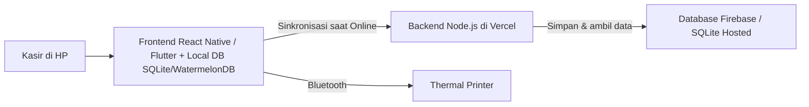

# PRD — Project Requirements Document

## 1. Overview

Warung makan babi **Samsam Guling Bu Eka** umumnya masih mencatat pesanan di buku tulis atau mengandalkan hafalan. Hal ini membuat proses kasir lambat, rawan salah hitung, dan sulit mengetahui penjualan harian.

Aplikasi POS Mobile untuk **Samsam Guling Bu Eka** hadir sebagai alat bantu kasir yang simpel dan bersih. Tujuan utamanya adalah:

- Memudahkan kasir melihat daftar menu dan mencatat pesanan langsung dari layar HP.
- Menghitung total belanja secara otomatis dan akurat.
- Memberikan catatan penjualan yang rapi, mulai dari riwayat transaksi hingga laporan harian.
- Membantu pemilik warung mengelola menu makanan dan minuman tanpa perlu catatan manual.
- Memantau stok bahan baku dan mencatat hutang pelanggan maupun hutang ke supplier.
- Menjamin operasional tetap berjalan meski koneksi internet tidak stabil dengan mode offline-first.

Desain aplikasi mengikuti referensi yang diberikan: bersih, minimalis, bernuansa biru-putih, menggunakan kartu membulat dan ikon flat agar nyaman digunakan pemilik warung yang tidak terbiasa dengan teknologi rumit.

## 2. Requirements

- Aplikasi berbasis mobile menggunakan **React Native** atau **Flutter** agar dapat berjalan di HP Android dan iOS.
- Tampilan mengikuti gaya referensi: clean, minimalis, dominan biru-putih, kartu rounded, dan ikon flat.
- Backend menggunakan **Node.js** sebagai API yang melayani permintaan dari aplikasi mobile.
- Data disimpan di **Firebase** atau **SQLite** (dengan sinkronisasi) dan di-deploy ke **Vercel**.
- **Offline-First Mode**: Aplikasi dapat mencatat transaksi tanpa internet dan melakukan sinkronisasi otomatis saat koneksi tersedia.
- Pemilik/kasir warung cukup berinteraksi lewat layar sentuh, tanpa perlu pengetahuan teknis.
- Proses transaksi harus cepat: lihat menu, pilih pesanan, hitung total, lalu selesaikan.
- Semua transaksi yang selesai tersimpan dan bisa dilihat kembali sebagai riwayat penjualan.
- Dashboard utama menampilkan header branding, kartu ringkasan biru, grid menu 8 ikon, tabel penjualan mingguan, dan bottom navigation.
- Mendukung konektivitas ke **Bluetooth Thermal Printer** untuk cetak struk fisik.
- Tidak ada fitur tambahan di luar roadmap yang telah disepakati.

## 3. Core Features

### Fase 1 — Kasir & Konektivitas

- **Kasir** — Layar utama untuk melihat menu, memilih pesanan, dan menghitung total otomatis.
  - **Lihat Daftar Menu** — Semua menu makanan tampil dalam kartu yang rapi dan mudah dipilih, dikelompokkan berdasarkan kategori spesifik warung babi.
  - **Pilih & Sesuaikan Pesanan** — Kasir dapat menambah menu ke pesanan dan mengubah jumlahnya langsung dari layar.
  - **Modifier/Varian Produk** — Fitur wajib untuk memilih varian dasar seperti **Porsi Kecil/Besar**, **Dengan Nasi/Tanpa Nasi**, atau pilihan paket lainnya yang mengubah harga dasar secara otomatis.
  - **Kustomisasi Pesanan (Add-ons)** — Kasir dapat memilih opsi tambahan untuk setiap menu, misalnya **Tambah Kulit** atau **Tambah Kerupuk Babi**, sesuai permintaan pelanggan.
  - **Tipe Pesanan** — Kasir dapat menentukan apakah pesanan akan dimakan di tempat (**Dine-in**) atau dibungkus (**Takeaway**) sebelum menyelesaikan transaksi.
  - **Pindah Meja** — Untuk pelanggan yang berpindah meja, kasir dapat mengubah nomor meja pada pesanan aktif tanpa mengubah isi pesanan.
  - **Hitung Total Otomatis** — Total harga dihitung otomatis berdasarkan item, jumlah, varian, dan opsi kustomisasi yang dipilih.
  - **Selesaikan Transaksi** — Pesanan yang sudah selesai disimpan dan masuk ke riwayat penjualan.
  - **Cetak Struk Bluetooth** — Integrasi dengan printer thermal Bluetooth. Header menampilkan ikon printer untuk mencetak struk transaksi setelah pesanan diselesaikan secara instan.
  - **Offline-First Mode** — Memastikan kasir tetap bisa melakukan input pesanan dan checkout meskipun sinyal di warung sedang buruk. Data akan disinkronkan ke server saat internet kembali aktif.

### Fase 2 — Manajemen Menu, Stok Bahan Baku & Riwayat Penjualan

- **Manajemen Menu & HPP Dinamis** — Mengelola daftar menu makanan dan minuman milik warung.
  - **Update HPP Dinamis** — Fitur khusus untuk memperbarui Harga Pokok Penjualan (HPP) harian, terutama untuk daging babi yang harganya fluktuatif, guna memantau margin keuntungan yang akurat.
  - **Kategori Menu Spesifik** — Kategori menu disesuaikan dengan budaya warung babi, yaitu **Babi Guling**, **Sate Babi**, **Lawar**, dan **Aneka Sambal**.
  - **Tambah Menu & Varian** — Menambahkan menu baru beserta nama, harga, kategori, stok ketersediaan, dan pilihan varian (porsi).
  - **Ubah/Hapus Menu** — Memperbarui atau menghapus informasi menu yang sudah tidak dijual.

- **Manajemen Stok Bahan Baku** — Memantau ketersediaan bahan utama seperti daging babi dan sayur untuk lawar agar tidak habis atau tidak segar.
  - **Peringatan Stok Menipis/Habis** — Menampilkan notifikasi saat stok bahan hampir habis atau sudah kedaluwarsa.
  - **Catatan Kesegaran** — Memberi tanda pada bahan yang cepat rusak (misal daging babi, sayur lawar) agar segera digunakan sebelum basi.

- **Riwayat Penjualan** — Melihat kembali semua transaksi yang sudah selesai dengan rapi.
  - **Lihat Daftar Transaksi** — Menampilkan riwayat penjualan urut dari yang terbaru.
  - **Detail Transaksi** — Membuka rincian item, kustomisasi, varian, dan total dari satu transaksi.
  - **Saring per Tanggal** — Menyaring riwayat berdasarkan tanggal agar mudah dicari.

### Fase 3 — Laporan Harian, Pembayaran & Hutang

- **Laporan Harian** — Melihat total penjualan harian dan ringkasannya dalam satu layar.
  - **Lihat Total Hari Ini** — Menampilkan total uang masuk hari ini di bagian atas laporan.
  - **Rincian Metode Pembayaran** — Menampilkan breakdown penjualan per metode: **Tunai**, **QRIS**, **Transfer**, dan **Hutang**.
  - **Pemisahan Offline vs Online** — Laporan membedakan penjualan **Offline (Tunai)** dan **Online (GoFood/Grab/QRIS)** untuk memudahkan rekonsiliasi.
  - **Grafik Penjualan** — Menampilkan tren penjualan dalam bentuk grafik yang mudah dipahami.
  - **Pilih Rentang Tanggal** — Mengubah periode laporan ke tanggal tertentu.

- **Hutang Pelanggan & Hutang ke Supplier** — Mengelola catatan utang dari dua arah.
  - **Hutang Pelanggan** — Mencatat pesanan yang belum dibayar oleh pelanggan (uang belum bayar).
  - **Hutang ke Supplier** — Mencatat utang warung ke pemasok bahan baku, seperti penjual daging babi.

## 4. User Flow

### Alur Dashboard Utama

1. Kasir/pemilik membuka aplikasi dan melihat **Dashboard Utama**.
2. **Header** menampilkan nama bisnis **Samsam Guling Bu Eka** dan sapaan admin, dengan ikon printer untuk status koneksi printer.
3. **Kartu Ringkasan Biru** menampilkan "Ringkasan Hari Ini" (Total, jumlah transaksi, rata-rata) serta breakdown Tunai, QRIS, Transfer, dan Hutang.
4. **Grid Menu Utama** menampilkan 8 ikon: **Laci Kas**, **Produk**, **Laporan**, **Buku Kas**, **Hutang**, **Pelanggan**, **Karyawan**, dan **Lainnya**.
5. Bagian **Penjualan Minggu Ini** menampilkan tabel pendapatan per metode pembayaran; jika offline, muncul indikator "Menunggu Sinkronisasi".
6. Kasir menggunakan **Bottom Navigation Bar** untuk berpindah: **Beranda**, **Riwayat**, tombol tengah besar **Keranjang/Checkout**, **Notifikasi**, dan **Akun**.

### Alur Kasir / Mencatat Pesanan (Offline-Ready)

1. Kasir membuka aplikasi dan masuk ke layar **Kasir**.
2. Kasir mengetuk menu, lalu muncul pilihan **Modifier/Varian** (misal: Porsi Besar/Kecil).
3. Kasir memilih **Kustomisasi** tambahan (misal: Tambah Kulit).
4. Kasir memilih **Tipe Pesanan**: **Dine-in** atau **Takeaway**.
5. Total harga terhitung otomatis. Jika internet mati, aplikasi menyimpan transaksi secara lokal.
6. Kasir menekan **Selesaikan Transaksi** dan aplikasi secara otomatis mengirim perintah cetak ke **Bluetooth Thermal Printer**.

### Alur Manajemen Menu & HPP

1. Pemilik masuk ke modul **Produk**.
2. Pemilik memperbarui **HPP (Cost Price)** daging babi sesuai harga pasar hari ini.
3. Pemilik mengatur varian harga untuk menu tertentu (misal: Nasi Bungkus vs Makan di Tempat).
4. Data tersimpan dan langsung berpengaruh pada perhitungan laba di laporan.

## 5. Architecture



## 6. Database Schema

### Tabel `users`
| Kolom | Tipe | Kegunaan |
|---|---|---|
| `id` | PK | Identitas unik pengguna |
| `name` | text | Nama pengguna |
| `role` | text | `owner` atau `cashier` |

### Tabel `categories`
| Kolom | Tipe | Kegunaan |
|---|---|---|
| `id` | PK | Identitas kategori (Babi Guling, Sate, dll) |
| `name` | text | Nama kategori |

### Tabel `menus`
| Kolom | Tipe | Kegunaan |
|---|---|---|
| `id` | PK | Identitas unik menu |
| `name` | text | Nama menu |
| `base_price` | int | Harga jual dasar |
| `cost_price` | int | **HPP Dinamis** (Harga pokok produksi) |
| `category_id` | FK | Relasi ke kategori |
| `stock` | int | Stok porsi |
| `available` | bool | Status aktif |

### Tabel `modifiers`
| Kolom | Tipe | Kegunaan |
|---|---|---|
| `id` | PK | Identitas modifier |
| `menu_id` | FK | Relasi ke menu |
| `name` | text | Nama varian (misal: "Porsi Jumbo", "Tanpa Nasi") |
| `price_extra` | int | Penambahan/pengurangan harga (misal: +5000 atau -2000) |

### Tabel `ingredients`
| Kolom | Tipe | Kegunaan |
|---|---|---|
| `id` | PK | Identitas bahan baku |
| `name` | text | Daging Babi, Sayur, dll |
| `stock` | int | Jumlah stok |
| `is_perishable`| bool | Penanda bahan cepat rusak |
| `expiry_date` | timestamp| Tanggal kadaluwarsa |

### Tabel `orders`
| Kolom | Tipe | Kegunaan |
|---|---|---|
| `id` | PK | Identitas transaksi |
| `order_type` | text | `dine_in` / `takeaway` |
| `table_number` | int | Nomor meja |
| `total_amount` | int | Total akhir |
| `sync_status` | text | `pending` / `synced` (Untuk Offline-First) |
| `created_at` | timestamp| Waktu transaksi |

### Tabel `order_items`
| Kolom | Tipe | Kegunaan |
|---|---|---|
| `id` | PK | Identitas item |
| `order_id` | FK | Relasi ke transaksi |
| `menu_id` | FK | Menu yang dipilih |
| `modifier_ids` | text | ID varian/modifier yang dipilih |
| `customization`| text | Catatan tambahan (Tambah kulit, dll) |
| `subtotal` | int | Harga item x qty + modifier |

### Tabel `transactions`
| Kolom | Tipe | Kegunaan |
|---|---|---|
| `id` | PK | Identitas pembayaran |
| `order_id` | FK | Relasi ke order |
| `payment_method`| text | Tunai, QRIS, Transfer, Hutang |
| `transaction_type`| text | Offline atau Online |
| `status` | text | `paid` / `unpaid` |

## 7. Tech Stack

- **Frontend Mobile:** React Native atau Flutter.
- **Offline Persistence:** **WatermelonDB** atau **SQLite** (sebagai local storage untuk strategi Offline-First).
- **Bluetooth Library:** `react-native-bluetooth-escpos-printer` atau `flutter_blue_plus` (untuk koneksi ke Thermal Printer).
- **Backend:** Node.js (REST API) di Vercel.
- **Database Utama:** Firebase (Firestore) atau SQLite hosted (Turso/LibSQL) dengan sinkronisasi periodik.
- **UI/Styling:** Clean minimalis biru-putih, kartu rounded, ikon flat pastel.

## 8. UI/UX Wireframe

### 8.1 Layar Input Pesanan (Kustomisasi & Modifier)
```
+------------------------------------------+
| Pilih Varian:                            |
| ( ) Porsi Biasa      (Rp 0)              |
| (x) Porsi Jumbo      (+Rp 10.000)        |
| ( ) Tanpa Nasi       (-Rp 5.000)         |
|                                          |
| Tambahan (Add-ons):                      |
| [x] Tambah Kulit     (+Rp 5.000)         |
| [ ] Kerupuk Babi     (+Rp 3.000)         |
|                                          |
| [Batal]          [Tambah ke Keranjang]   |
+------------------------------------------+
```

### 8.2 Layar Checkout
```
+------------------------------------------+
| Ringkasan Pesanan                        |
| 1x Nasi Babi Guling (Jumbo)    35.000    |
|    + Tambah Kulit               5.000    |
|                                          |
| Total:                         40.000    |
+------------------------------------------+
| Metode Pembayaran:                       |
| [Tunai] [QRIS] [Transfer] [Hutang]       |
+------------------------------------------+
| [ BAYAR & CETAK STRUK ]                  |
| Status Printer: Terkoneksi (Bluetooth)   |
+------------------------------------------+
```